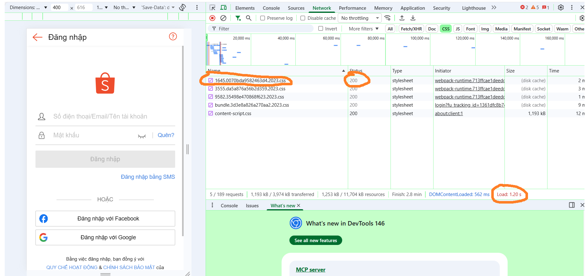
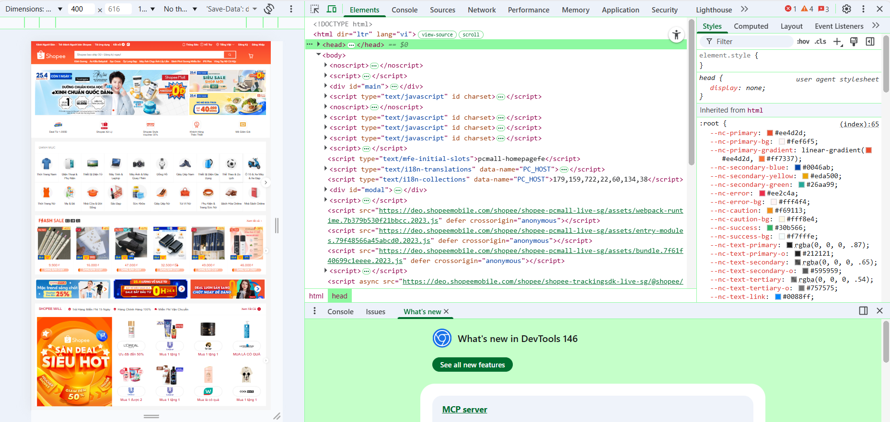
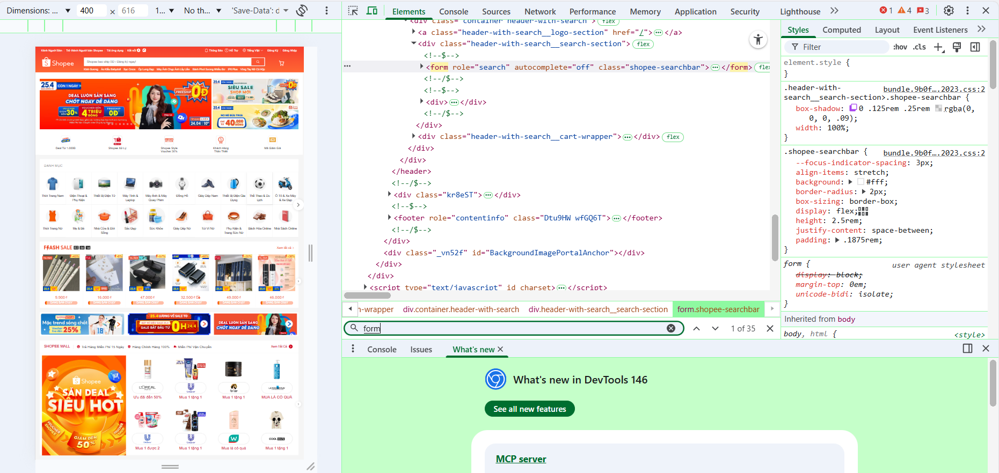

#  ANSWERS — PBT_01 HTML Fundamentals


---

#  PHẦN A — KIỂM TRA ĐỌC HIỂU

---

##  Câu A1 — HTTP & Browser

**Nguồn:** `01_introduction_html_universe.md` — Phần Browser & HTTP Flow

### a) Các bước khi truy cập https://shopee.vn

1. Trình duyệt thực hiện **DNS Lookup** để tìm địa chỉ IP của `shopee.vn`
2. Thiết lập kết nối **TCP (3-way handshake)**
3. Thực hiện **TLS Handshake** để mã hóa HTTPS
4. Gửi **HTTP Request (GET)** đến server
5. Server trả về **HTTP Response** (HTML, CSS, JS)
6. Trình duyệt parse HTML → tạo **DOM**
7. Tải CSS → tạo **CSSOM**
8. Kết hợp DOM + CSSOM → **Render Tree**
9. Thực hiện **Layout → Paint → Composite** để hiển thị

---

### b) Tab Network trong DevTools

Tab Network cho phép:

* Xem tất cả request (HTML, CSS, JS, images...)
* Kiểm tra **Status Code** (200, 404, 500...)
* Xem **thời gian load**
* Xem **Headers và Response**

**Screenshot:**



**Đánh dấu:**

* Status Code request đầu tiên
* Tổng thời gian load
* Một request file CSS

---

##  Câu A2 — Semantic HTML

**Nguồn:** `04_semantic_html.md` — Phần Semantic Elements

###  Lỗi semantic

1. Dùng `<div>` thay vì `<header>`
2. Menu không dùng `<nav>`
3. Không có `<main>`
4. Sản phẩm không dùng `<article>`
5. Không dùng heading (`<h1>`, `<h2>`)
6. Không có `<footer>`

---

###  Code sửa

```html
<header>
    <h1>ShopTLU</h1>
    <nav>
        <a href="/">Trang chủ</a>
        <a href="/products">Sản phẩm</a>
    </nav>
</header>

<main>
    <article>
        <h2>iPhone 16 Pro</h2>
        <p>25.990.000đ</p>

        <figure>
            
            <figcaption>iPhone 16 Pro</figcaption>
        </figure>
    </article>
</main>

<footer>
    <p>&copy; 2026 ShopTLU</p>
</footer>
```

---

##  Câu A3 — Block vs Inline

**Nguồn:** `01_introduction_html_universe.md` — Phần Block vs Inline

###  Kết quả hiển thị

Hộp 1
Text A Text B

Hộp 2
Text C Text D

Hộp 3

###  Giải thích

* `<div>` là **block element** → luôn xuống dòng
* `<span>`, `<strong>` là **inline element** → hiển thị cùng dòng
* Vì vậy các text A, B, C, D nằm cùng dòng theo từng nhóm

---

##  Câu A4 — Table

**Nguồn:** `05_tables_hyperlinks.md` — Phần Table Structure

###  Phân biệt

* `<thead>`: chứa tiêu đề bảng
* `<tbody>`: chứa dữ liệu chính
* `<tfoot>`: chứa phần tổng kết

###  Không nên dùng table để layout vì:

* Không responsive (khó thích ứng mobile)
* Code khó đọc, khó bảo trì
* Không tốt cho SEO
* Accessibility kém (screen reader khó hiểu)

---

#  PHẦN C — SUY LUẬN

---

##  Câu C1 — Thiết kế cấu trúc

```html
<header>
    <!-- Header chứa logo + navigation -->
    <nav>
        <a href="#">Trang chủ</a>
        <a href="#">Danh mục</a>
    </nav>
</header>

<nav aria-label="breadcrumb">
    <!-- Breadcrumb navigation -->
    <ol>
        <li><a href="#">Trang chủ</a></li>
        <li><a href="#">Điện thoại</a></li>
        <li>iPhone 16</li>
    </ol>
</nav>

<main>

<section>
    <h2>Hình ảnh sản phẩm</h2>
    
    
    
    
    
</section>

<section>
    <h1>iPhone 16</h1>
    <p>25.990.000đ</p>
    <p>★★★★☆</p>
    <p>Mô tả sản phẩm</p>
</section>

<section>
    <h2>Thông số kỹ thuật</h2>
    <table>
        <thead>
            <tr>
                <th>Thông số</th>
                <th>Chi tiết</th>
            </tr>
        </thead>
        <tbody>
            <tr>
                <td>Chip</td>
                <td>A18</td>
            </tr>
        </tbody>
    </table>
</section>

<section>
    <h2>Đánh giá</h2>
    <article>
        <h3>Người dùng</h3>
        <p>Rất tốt</p>
    </article>
</section>

<aside>
    <h2>Sản phẩm tương tự</h2>
</aside>

</main>

<footer>
    <p>&copy; 2026 Shop</p>
</footer>
```


---

##  Câu C2 — Tranh luận

Việc sử dụng semantic HTML thay vì chỉ dùng `<div>` mang lại nhiều lợi ích quan trọng.

* **SEO:** Công cụ tìm kiếm hiểu nội dung tốt hơn nhờ các thẻ như `<header>`, `<article>`, `<main>`
* **Accessibility:** Screen reader xác định đúng cấu trúc (ví dụ `<nav>`, `<article>`)
* **Maintainability:** Code rõ ràng, dễ bảo trì

**Ví dụ:**
Khi sản phẩm nằm trong `<article>`, Google hiểu đó là một nội dung độc lập.

Google dùng semantic để crawl tốt hơn.

Screen reader đọc theo landmark.

Ví dụ cụ thể hơn (Tiki/Shopee).


 Tuy nhiên, `<div>` vẫn cần khi chỉ dùng cho layout hoặc CSS.

---

#  PHẦN B3 — DEBUG HTML

**Nguồn:** Tổng hợp từ tài liệu 01 → 05

* Dòng 1 — `<!DOCTYPE>` sai → sửa thành `<!DOCTYPE html>`
* Dòng 4 — thiếu `</title>`
* Dòng 5 — `utf8` → `utf-8`
* Dòng 8 — `<h1>` không đóng đúng
* Dòng 12 — `<a>` không đóng
* Dòng 18 — `` thiếu dấu `"`
* Dòng 20 — `<b>` → dùng `<strong>`
* Table thiếu `<thead>` và `<tbody>`
* Có 2 thẻ `<main>` → thay 1 bằng `<aside>`
* Footer `<p>` chưa đóng
* `` thiếu thuộc tính `alt`

---


#  PHẦN B4 - Phân tích trang web thật(Shopee.vn)
---

## 1. Phân tích Semantic HTML

**Screenshot:**



### Các thẻ semantic HTML5 tìm được:

- Có sử dụng `<footer>` với role="contentinfo"
- Có sử dụng `<form>` cho chức năng tìm kiếm

### Các thẻ KHÔNG dùng đúng semantic:

- Phần header không dùng `<header>` mà sử dụng `<div>`
- Phần điều hướng không dùng `<nav>`
- Sản phẩm không dùng `<article>`
- Không thấy `<main>` bao nội dung chính

=> Trang chủ yếu sử dụng `<div>` để xây dựng layout (SPA - React)

---

## 2. Phân tích Table

Trang không sử dụng thẻ `<table>` trong nội dung chính.

Kết quả tìm kiếm trong DevTools không cho thấy table dùng để hiển thị dữ liệu.

---

## 3. Phân tích Form

**Screenshot:**



### Thông tin form:

<form role="search" autocomplete="off" class="shopee-searchbar">

### Thuộc tính:

- role="search"
- autocomplete="off"
- Không thấy method và action (xử lý bằng JavaScript)

### Input types được sử dụng:

- type="text" (ô tìm kiếm)
- type="submit" (nút tìm kiếm)

=> Shopee sử dụng form nhưng xử lý bằng JavaScript thay vì submit truyền thống.

---
